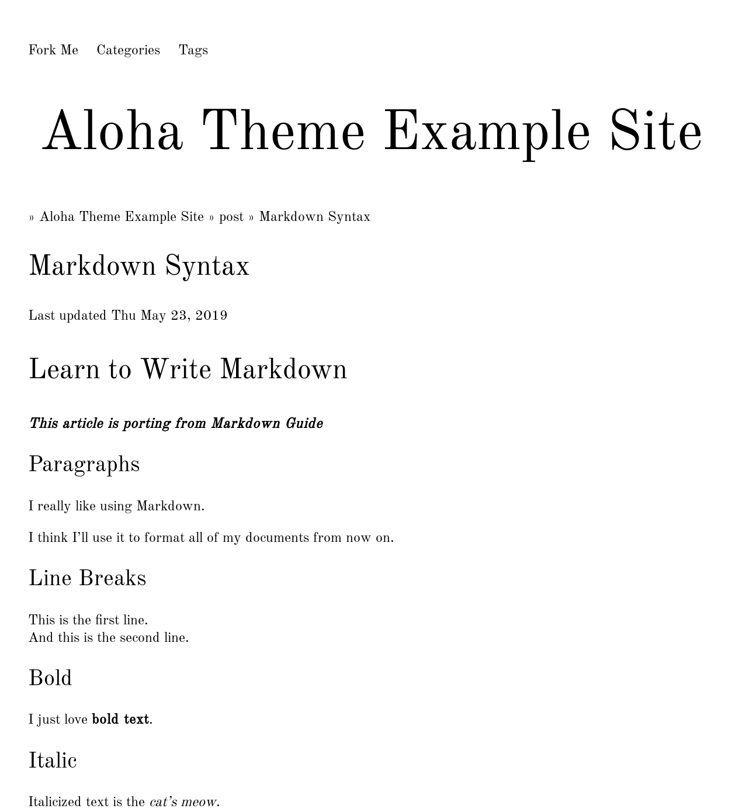

# Aloha

A clean hugo theme.



# Installation

Inside the folder of your Hugo site run:

```bash
git submodule add https://github.com/number317/aloha.git themes/aloha
```

For more information read the official [quick start](https://gohugo.io/getting-started/quick-start/) of Hugo.

# Config

Copy the [config.toml](https://github.com/number317/aloha/blob/master/exampleSite/config.toml) from this themes exampleSite to your Hugo site or use it as a reference.

- `disableWebFonts = false`: will load google web-fonts.
- `showSummary = true`: will show summary on list page.

Copy the [footer.toml](https://github.com/number317/aloha/blob/master/exampleSite/data/footer.toml)

- `author`: the information of about author
- `github`: your github url
- `email`: your email and subject
- `wechat`: the qrcode of you wechat account

# License

This theme is released under the MIT license. For more information read the [license](https://raw.githubusercontent.com/number317/aloha/master/LICENSE).
